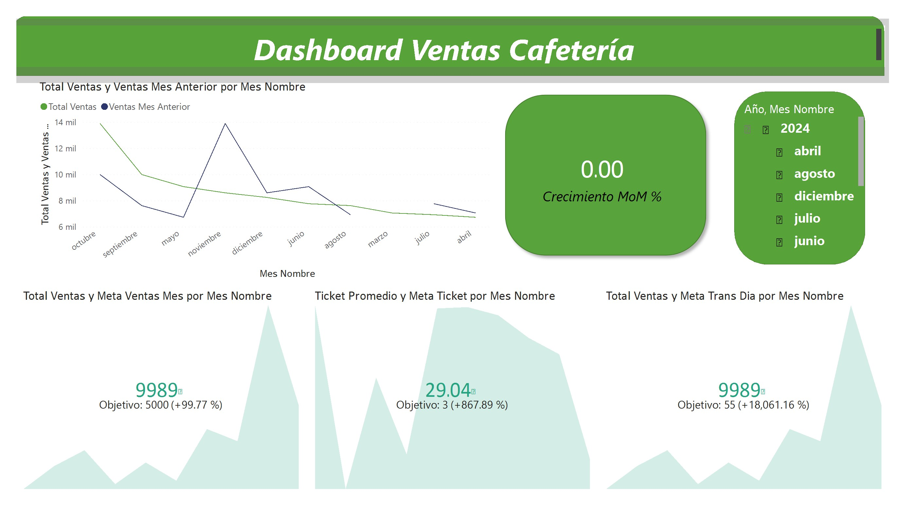
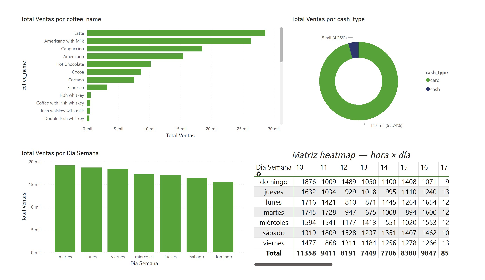

# ☕ Dashboard Ventas Cafetería — Power BI

Análisis de ventas de una cafetería con foco en productos, patrones temporales y comportamiento de pago. Desarrollado en Power BI sobre dataset de Kaggle.

## 📊 Vista previa

## 🎯 Preguntas de negocio respondidas

- ¿Qué productos generan más ingresos?
- ¿Qué días y horarios concentran más ventas?
- ¿Cuál es la distribución entre pagos en efectivo y tarjeta?

## 🔍 Hallazgos principales

- **Latte** es el producto estrella — lidera ventas por amplio margen seguido de Americano with Milk
- **Martes y lunes** son los días de mayor volumen; el domingo cae consistentemente
- **95.7% de las transacciones** se realizan con tarjeta — el negocio opera prácticamente sin efectivo
- El heatmap hora × día revela que **las 10hs del domingo** es el horario pico absoluto (1,876 transacciones)
- Las horas valle están entre las 14–15hs de miércoles — oportunidad para promociones dirigidas

## 🛠️ Stack

| Herramienta | Uso |
|-------------|-----|
| Power BI Desktop | Modelado, DAX, visualizaciones |
| DAX | Cálculo de métricas: ventas totales, MoM, ticket promedio |
| Dataset | [Coffee Sales — Kaggle](https://www.kaggle.com/datasets/ihelon/coffee-sales) |

## 📌 Características del dashboard

- **Página 1 — Overview:** KPIs principales, ventas por producto, distribución por método de pago
- **Página 2 — Temporal:** evolución MoM con comparación mes anterior, crecimiento %, objetivos
- **Matriz heatmap:** visualización hora × día para identificar picos operativos

---

**Gerónimo Pautazzo** · [LinkedIn](https://www.linkedin.com/in/gero-pautazzo-88900325a/) · [Portfolio completo](https://github.com/geronimo290)
